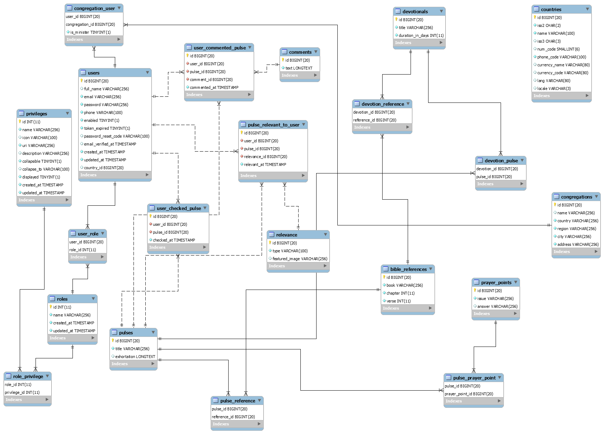

# Devotion For the Churches of Christ

* A minister creates a congregation

* A minister adds user to congregations

A devotional has a duration. If a devotional has a duration of n days, then it must have n pulses.
A pulse has a title, an exhortation, some scripture references, some prayer points.
Scripture reference is book, chapter and verse
Prayer point is, an issue and God’s answer

# Domain Model

